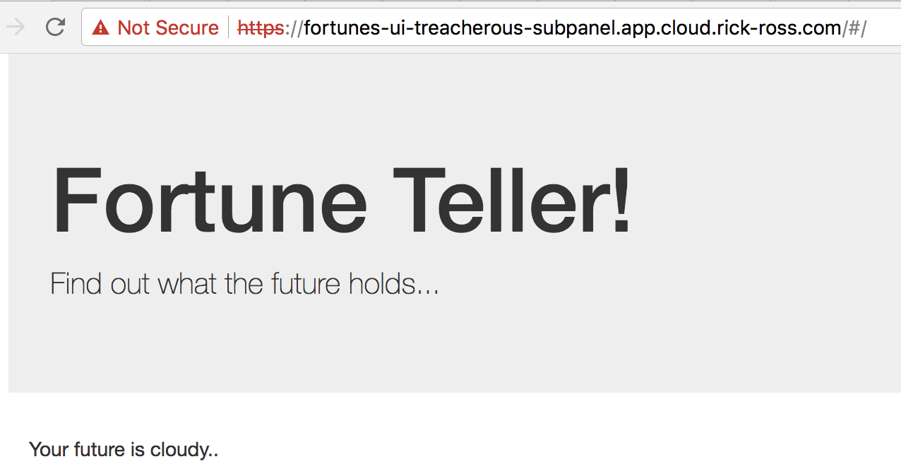
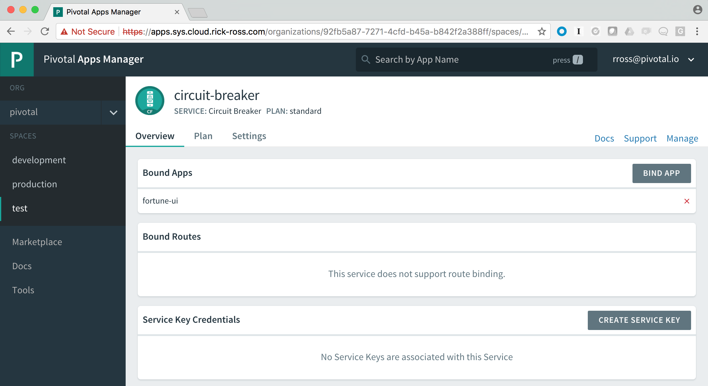
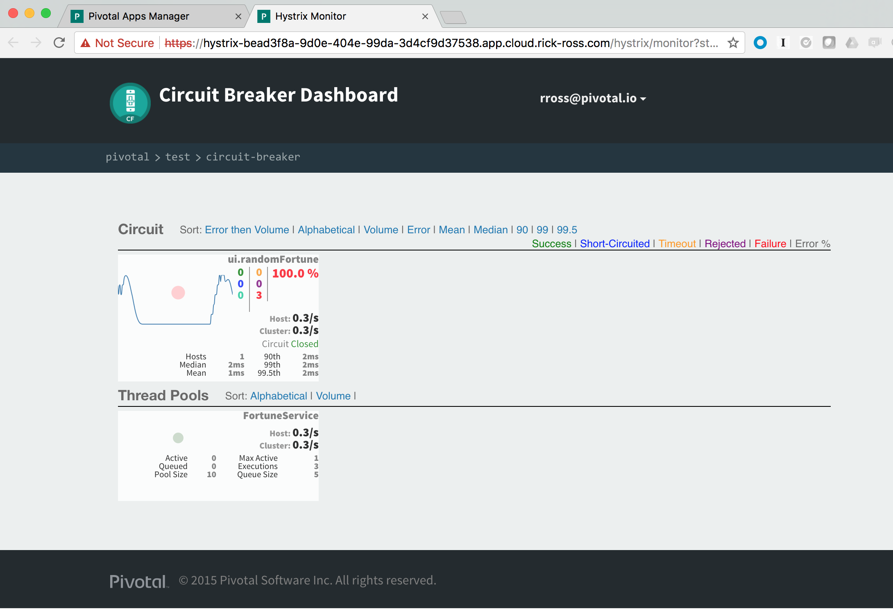

= Circuit Breaker

You'll learn how to provide fault tolerance for your microservices as well as monitoring the connections between microservices. To start the services and applications, You can follow instructions here: https://github.com/Pivotal-Field-Engineering/fortune-teller-demo

== Walkthrough

Spring Cloud Services contains a set of key features that are critical when leveraging Microservices. Pivotal, in partnership with Netflix, have made it even easier for developers to use these capabilities. 

As application architectures migrate to microservices there are an increasing number of interconnections between the different services. Inevitably, things break, which can cause a cascade of events, ultimately bubbling up to the person interacting with the system. In a microservics based architecture, the default assumption is to assume that things will break, so let's plan on taking care of that within our services. This notion is called AntiFragile. 

By assuming that things break, it enables us to build reliable systems from unreliable components. This is a key part of writing Cloud Native Applications. Furthermore, being able to see how these interactions are working (or not) is critical for identifying and resolving issues.

What if, with a few lines of code, provide a default implementation when a Microservice is unavailable? What if you could look at a dashboard and identify where there are problems?

With Spring Cloud Services - Circuit Breaker, you can do exactly that. 

Let's see what that looks like.

First, let's see what the application looks like when everything is working. Navigate to the application URL in a browser. It should look similar to this:

image::fortunetellerrunningnormally.png[]

In particular, notice the fortune, in this case it is "You learn from your mistakes... You will learn a lot today." This fortune changes as you refresh the browser. And if for any reason the Fortune Service is unavailable, there is a default message that is returned.

Now, let's stop the fortune-service application. You can do this from the App Manager or from the command line. These instructions will show using the CF CLI command to stop the server.

```bash
cf stop fortune-service
Stopping app fortune-service in org pivotal / space test as rross@pivotal.io...
OK
```

Go back and visit the Fortune Teller application in a browser.



Let's look at the source code to see how this is implemented. 

Open up the link:https://github.com/Pivotal-Field-Engineering/fortune-teller-demo/blob/master/fortune-teller-ui/src/main/java/io/spring/cloud/samples/fortuneteller/ui/services/fortunes/FortuneService.java[FortuneService class]. This is the class that calls the actual Fortune Service, which is shown below.

```java

@Service
@EnableConfigurationProperties(FortuneProperties.class)
public class FortuneService {

    @Autowired
    FortuneProperties fortuneProperties;

    @Autowired
    RestTemplate restTemplate;

    @HystrixCommand(fallbackMethod = "fallbackFortune")
    public Fortune randomFortune() {
        return restTemplate.getForObject("http://fortunes/random", Fortune.class);
    }

    private Fortune fallbackFortune() {
        return new Fortune(42L, fortuneProperties.getFallbackFortune());
    }
}

```

In particular, notice the _randomFortune()_ method. There is an @HystrixCommand attribute associated with it that indicates a default method to use when the microservice is not available. In this case, it is calling the _fallbackFortune()_, which returns a Fallback Fortune. If you want to learn more about how this works, look at the link:../ConfigServer/demo_config_server.adoc[Config Server Demo].

One way of thinking about this attribute is that it wraps the method in a try/catch and if an exception is thrown, it calls the Fallback Method. It also communciates with the Hystrix Dashboard for visualization purposes which will see in a moment. 

=== Hystrix Dashboard

The Circuit Breaker Service is available within the Applications Manager. Login to Apps Manager and navigate to the Org and Space where the application is deployed.

image::appmanager.png[]

Click on the Services tab and then on the Circuit Breaker Server.

image::circuitbreaker.png[]

This will open up the details for the Configuration Server, showing which applications are bound to it, as well as additional information regarding the configuration.



Click on the Manage link in the upper right. Use your credentials to log in if necessary. You can now see the circuit breaker dashboard

image::circuitbreakerdashboard.png[]

With the Fortune Service still stopped, refresh the browser with the Fortune UI application several times. 



You'll see the changes appear in the Dashboard. In particular, notice the number of failures, shown in red above. 

After starting the Fortune Service back up, either from the command line, shown below, or from the Apps Manager:

```bash
$ cf start fortune-service
Starting app fortune-service in org pivotal / space test as rross@pivotal.io...

Waiting for app to start...
```

Refresh the Fortune UI application in browser again several times and look at the Dashboard.

image:dashboardnormal.png[]

Notice that there are two calls in Green which indicate success. 

=== Conclusion

We've just demonstrated that with Spring Cloud Services - Circuit Breaker, you can easily make your microservices more reliable and fault tolerant, especially in a world where things periodically break. Providing default implementations when a microservice cannot be reached along with seeing the health of your microservices is done quickly and easily with Pivotal Cloud Foundry, Spring Cloud Services and Netflix.

