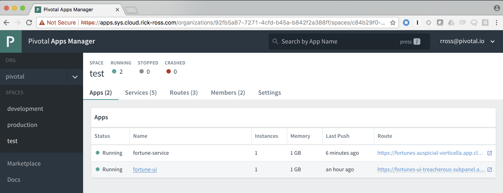
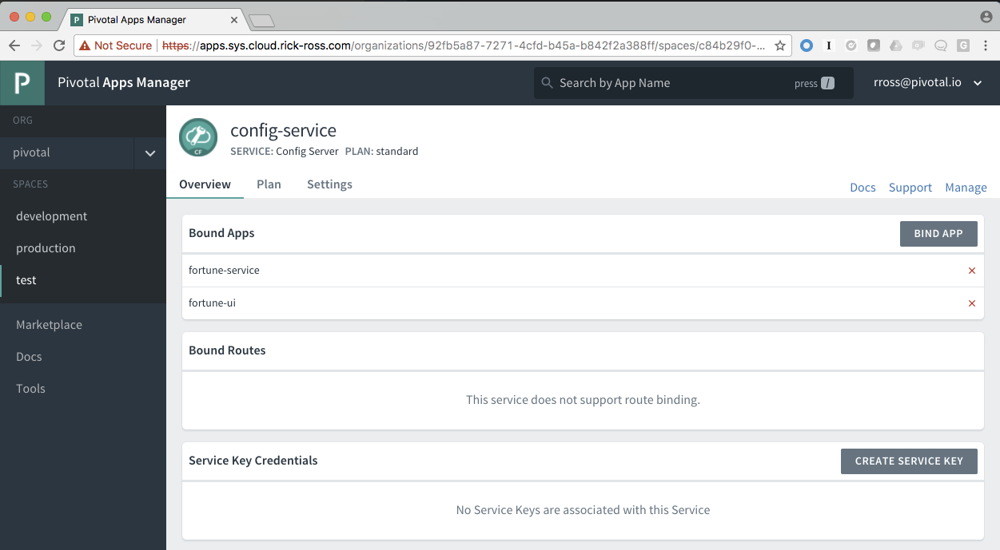
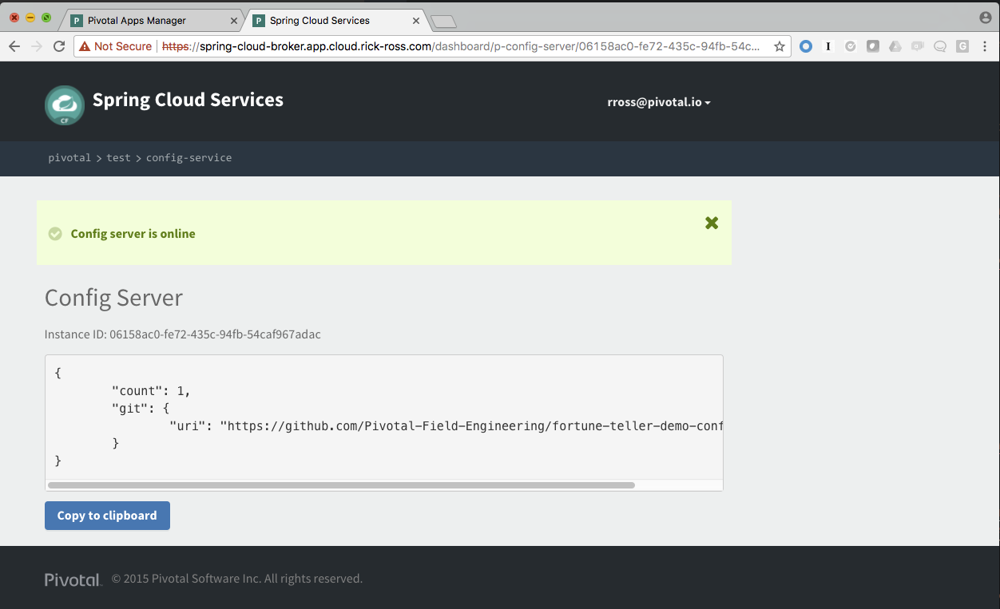
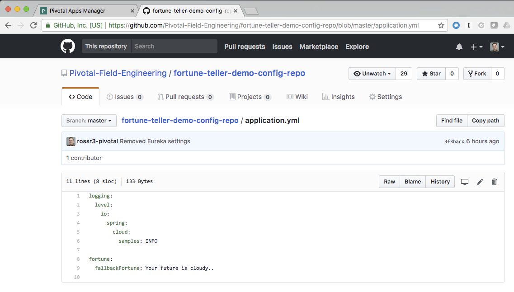
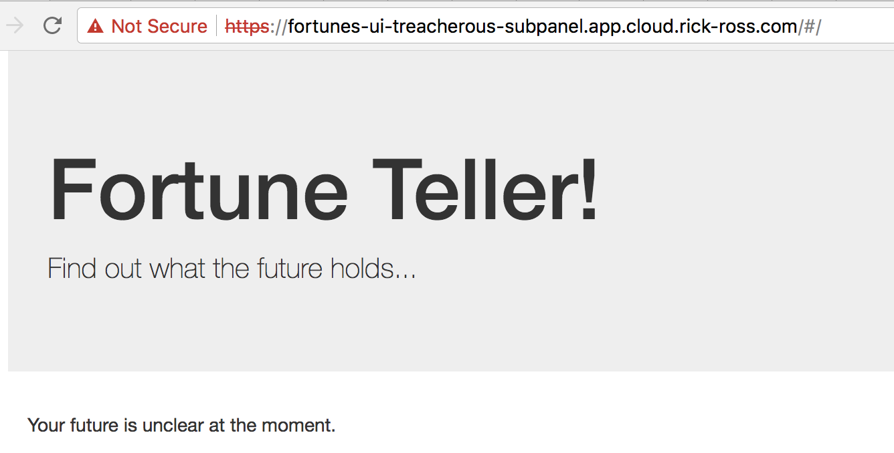
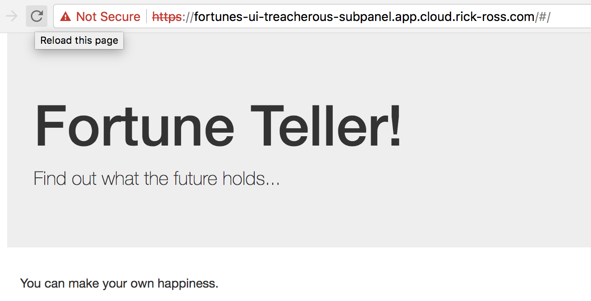

= Config Server 

You'll learn how to provision and deploy an application that uses a Config Server to externalize it's configuration properties. To start the services and applications, You can follow instructions here: https://github.com/Pivotal-Field-Engineering/fortune-teller-demo

== Walkthrough

Spring Cloud Services contains a set of key features that are critical when leveraging Microservices. Pivotal, in partnership with Netflix, have made it even easier for developers to use these capabilities. 

Traditionally developers bundle configuration within the application, typically in the form of properties files. These property files would be bundled up with the application binary and deployed. The challenge was that these property files contain environment specific values, which is critical to make sure that your production environment only uses the production systems. Similarly, other environments needed values specific to them. The typical solution was either to unpack the application binary (e.g. JAR, WAR and/or EAR) changing the values and then packing it back up, or doing another build with using a different properties files. 

While this works, it makes automating your CI/CD pipelines more complex than they need to be. What if you could retrieve application configuration information from a git repository? And when that repository is updated, refresh the configuration without starting your application? 

With Spring Cloud Services - Config Server, you can do exactly that. 

Let's see what that looks like. 

First, let's see what the application looks like when everything is working. Navigate to the application URL in a browser. It should look similar to this:

image::fortunetellerrunningnormally.png[]

In particular, notice the fortune, in this case it is "You learn from your mistakes... You will learn a lot today."

Now let's learn more about Spring Cloud Services - Config Server.

By default, when the create_services-pf.sh script is run, it sets the configuration server to link:https://github.com/Pivotal-Field-Engineering/fortune-teller-demo-config-repo[Demo Config Repository]. Inside of this repository is an application.yml file that provides a default response if the fortune service is unavailable. 

The Config Service is available within the Applications Manager. Login to Apps Manager and navigate to the Org and Space where the application is deployed.



Click on the Services tab and then on the Config Server.

image::configserver.png[]

This will open up the details for the Configuration Server, showing which applications are bound to it, as well as additional information regarding the configuration.



Click on the Manage link in the upper right. Use your credentials to log in if necessary. You can now see the configuration of this specific instance the configuration server.



When the Fortune Teller UI application starts up, it retrieves it's configuration from the Config Server. The Config Server, retrieves that configuration information from the backing git repository. 

For the 2017 Spring One Conference, we will want to log into github with the S1PDemo credentials (paasw0rd!) to modify the  application.yml file

or if you have forked the config repo, you will want to go to your forked repo and modify the application.yml file i that location

Click the link:https://github.com/Pivotal-Field-Engineering/fortune-teller-demo-config-repo/blob/master/application.yml[Configuration Repository] link. You'll see the configuration that the Fortune UI application uses when it cannot establish a connection to the Fortune Service application.  



Now edit this file by clicking the pencil icon in the upper right of the edit area.

Change the value of the fallbackFortune to something like this

```
fortune:
  fallbackFortune: Your future is unclear at the moment.
```

Scroll down and put in a commit message and Commit the change directly to the master branch and commit the changes.

image::commitmessage.png[]

Now, let's stop the fortune-service application. You can do this from the App Manager or from the command line. These instructions will show using the CF CLI command to stop the server.

```bash
cf stop fortune-service
Stopping app fortune-service in org pivotal / space test as rross@pivotal.io...
OK
```

Go back and visit the Fortune Teller application in a browser.

image::fortunetellerdefaultdownmessage.png[]

Notice that this message reflects the value that was in the Git Repository when the application started up. To inform the application to retreive the application configuration again, we need to hit a special endpoint on the Fortune UI application. Specifically, an empty POST request needs to be sent to the /refresh endpoint. Using curl the command looks like this:

```bash
$ curl -k -X POST https://fortunes-ui-treacherous-subpanel.app.cloud.rick-ross.com/refresh
["config.client.version","fortune.fallbackFortune"]
```

Now when you revisit the Fortune Teller UI in the browser and refresh, you get the message that was stored in the git repository:



How did that actually work? If you take a look in the FortuneProperties.java file, there is a @RefreshScope annotation on the class. This attribute signals Spring that if there is a refresh event it's configuration should be retreived again. For more information on this topic, look link:http://cloud.spring.io/spring-cloud-static/docs/1.0.x/spring-cloud.html#_refresh_scope[here]

After starting the Fortune Service back up, either from the command line, shown below, or from the Apps Manager

```bash
$ cf start fortune-service
Starting app fortune-service in org pivotal / space test as rross@pivotal.io...

Waiting for app to start...
```

And visiting the Fortune Teller UI in the browser and refreshing, you now get a non-default message:



=== Conclusion

We've just demonstrated that with Spring Cloud Services - Config Server, you can easily move configuration from your microservices into a git repository so you can track who makes what changes over time. In addition, we demonstrated how you can refresh the configuration without restarting your application, eliminating downtime. Pivotal Cloud Foundry, Spring Cloud Services and Netflix are a powerful combination, helping developers to be more efficient with their time.
