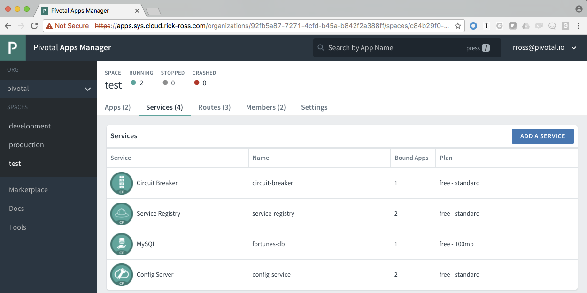
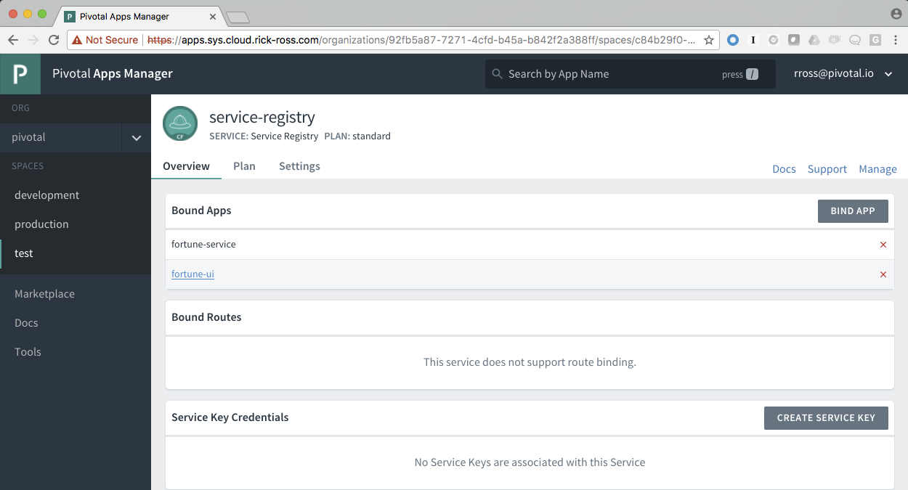
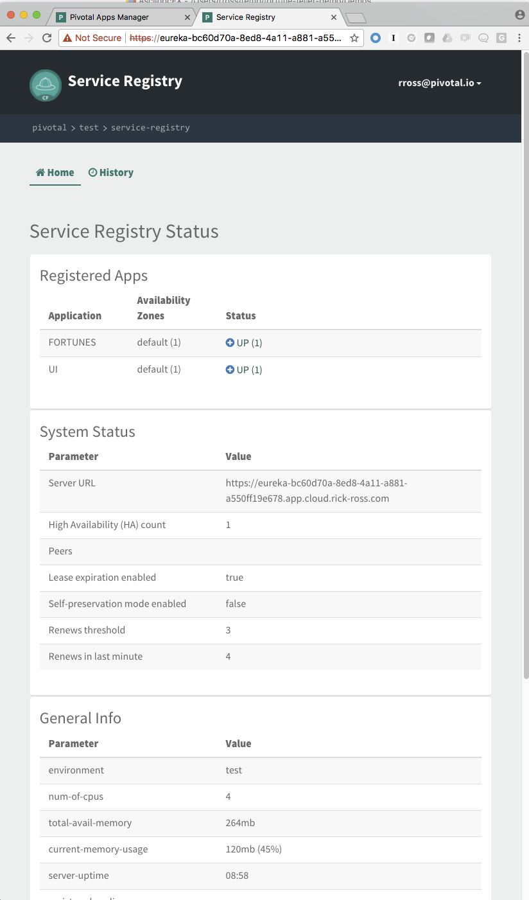

= Service Registry

You'll learn how to use the Service Registry to avoid hard coding URLs in applications. 

== Building

. If you haven't already built this project, use the Maven Wrapper to build and package the application:
+
----
$ git clone [REPO]
$ cd [REPO]
$ ./mvnw package
----

== Deploying to Pivotal Cloud Foundry with Spring Cloud Services

. Run `scripts/create-services_pcf.sh` to create the services that you need on Pivotal Cloud Foundry:
+
----
$ ./create_services_pcf.sh
Creating service fortune-db in org microservices / space fortune-teller as admin...
OK
Creating service config-server in org microservices / space fortune-teller as admin...
OK

Create in progress. Use 'cf services' or 'cf service config-service' to check operation status.
Creating service service-registry in org microservices / space fortune-teller as admin...
OK

Create in progress. Use 'cf services' or 'cf service service-registry' to check operation status.
Creating service circuit-breaker in org microservices / space fortune-teller as admin...
OK

Create in progress. Use 'cf services' or 'cf service circuit-breaker' to check operation status.
----

. Wait until the config-server, service-registry and circuit-breaker services have been created. Use the command cf services and wait until the last operation for these services is create succeeded. This might take a few minutes.  

. Edit the `manifest-pcf.yml` file to specify the Cloud Foundry target the apps are being pushed to, *replacing the URL* in `TRUST_CERTS: api.sys.cloud.rick-ross.com` with the API endpoint for your Cloud Foundry deployment.

. Push the microservices:

+
----
$ cf push -f manifest-pcf.yml
----
+
This will push the fortunes service and the ui application and bind all of the services.

== Walkthrough

Spring Cloud Services contains a set of key features that are critical when leveraging Microservices. Pivotal, in partnership with Netflix, have made it even easier for developers to use these capabilities.

As application architectures migrate to microservices, one question that comes up consistently is how will the different microservices know where they are located? One solution, that is not optimal, is simply hard-coding the URLs. This works for a small number of microservices, but becomes overwhelming as new services are added. And when you also consider the number of environments you need for things like testing and integration, it quickly becomes apparent that hard-coding a URL isn't very effective. 

What if you had a way of refering to a service by an alias rather than it's full URL? Similar to the way DNS works, Spring Cloud Services Service Registry provides a central location for applications that offer a service (producers) to the Registry for client applications (consumers) to discover. Once the client discovers the information required to contact the producer, it communicates with the producer directly. The architecture diagram below demonstrates these interactions:

image::serviceregistryarchitecture.png[]

Let's see how this works.

=== Fortune UI

In this example, the producer application is Fortune Service and the consumer application is the Fortune UI. Browse through the  link:https://github.com/Pivotal-Field-Engineering/fortune-teller-demo/tree/master/fortune-teller-ui/src/main[source code] of Fortune UI application. Did you notice any hard coded URLs in any of the files? If you didn't already guess, the answer is no. 

If that's the case, how does Fortune UI know how to call the Fortune Service application? The first key is found in the link:https://github.com/Pivotal-Field-Engineering/fortune-teller-demo/blob/master/fortune-teller-ui/src/main/java/io/spring/cloud/samples/fortuneteller/ui/Application.java[Application class]. 

```java

@SpringBootApplication
@EnableDiscoveryClient
@EnableCircuitBreaker
public class Application {
	
    @Bean
    @LoadBalanced
    public RestTemplate restTemplate() {
      return new RestTemplate();
    }

    public static void main(String[] args) {
        SpringApplication.run(Application.class, args);
    }
}

```

Notice the @EnableDiscoveryClient attribute on the Application class. Using this attribute informs Spring to use the Eurkea DiscoveryClient implementation, to connect to a Eurkea Server. 

**Note**: In this case, when the scripts/create_services_pcf.sh script was run, an instance of a Service Registry (Eurkea) was created. In addition, the manifest used to push the applications to PCF (link:https://github.com/Pivotal-Field-Engineering/fortune-teller-demo/blob/master/manifest-pcf.yml[manifest-pcf.yml]) also binds the Fortune UI application to this Eurkea Server instance. 

The other thing to notice in this class is the creation of a RestTemplate bean that will be used to autowire a property in the link:https://github.com/Pivotal-Field-Engineering/fortune-teller-demo/blob/master/fortune-teller-ui/src/main/java/io/spring/cloud/samples/fortuneteller/ui/services/fortunes/FortuneService.java[FortuneService class] that calls the actual service, which is shown below.

```java

@Service
@EnableConfigurationProperties(FortuneProperties.class)
public class FortuneService {

    @Autowired
    FortuneProperties fortuneProperties;

    @Autowired
    RestTemplate restTemplate;

    @HystrixCommand(fallbackMethod = "fallbackFortune")
    public Fortune randomFortune() {
        return restTemplate.getForObject("http://fortunes/random", Fortune.class);
    }

    private Fortune fallbackFortune() {
        return new Fortune(42L, fortuneProperties.getFallbackFortune());
    }
}

```
In the _randomFortune()_ method, notice the URL used to reference the Fortune Services. It's not like a standard domain name and port (e.g. "https://mylongdomainname.com:8080"), but instead is simply called called "fortunes". This is the friendly name that the Service Registry uses to return back the URI to the fortune service. 

=== Fortune Service

Now it's time to look at what is required in the producer application, which in this case is the Fortune Service. Browse through the link:https://github.com/Pivotal-Field-Engineering/fortune-teller-demo/tree/master/fortune-teller-fortune-service/src/main[source code]. Did you notice any hard coding in this application? Again the answer is no. 

What's required for the producer? Let's find out.

```java

@SpringBootApplication
@EnableJpaRepositories
@EnableDiscoveryClient
public class Application {

    public static void main(String[] args) {
        SpringApplication.run(Application.class, args);
    }
}

```

Again, in the link:https://github.com/Pivotal-Field-Engineering/fortune-teller-demo/blob/master/fortune-teller-fortune-service/src/main/java/io/spring/cloud/samples/fortuneteller/fortuneservice/Application.java[Application Class], you'll find an @EnableDiscoveryClient attribute. Just like the consumer (Fortune UI), the producer (Fortune Service) also uses the same attribute. 

If you continue to look through the source code of the project, you won't see anything else that provides a clue into how it actually works or knows that this is the "fortunes" service as we used the Fortune UI application. 

The way the EnableDiscoverClient works, is to register itself with the Eureka Server. Recall that the Eurkea Server (Service Registry) was created and then bound to Fortune Server application in the link:https://github.com/Pivotal-Field-Engineering/fortune-teller-demo/blob/master/manifest-pcf.yml[manifest-pcf.yml] file. 

There is still the mystery of how the Service Registry (Eurkea) knows the name of the application. The answer, in this case, is found in the link:https://github.com/Pivotal-Field-Engineering/fortune-teller-demo/blob/master/fortune-teller-fortune-service/src/main/resources/bootstrap.yml[bootstrap.yml] file. 

```
spring:
  application:
    name: fortunes
```

The EnableDiscoveryClient uses the spring.application.name property to automatically register the application. Notice that both the producer (Fortune Service) and the consumer (Fortune UI) use the same method and there is nothing that is required to indicate whether it offers services or it just wants use other services. 

Let's take a look at what you see inside of Pivotal Cloud Foundry.

Login to Apps Manager and navigate to the Org and Space where the application is deployed.

image::appmanager.png[]

Click on the Services tab and then on the Serivces Registry.



This will open up the details for the Service Registry , showing which applications are bound to it, as well as additional information regarding the configuration.



Click on the Manage link in the upper right. Use your credentials to log in if necessary. You can now see the Service Registry Status, System Status, General Info and Instance Info. 



Notice that there are two applications that the Service Registry knows about: FORTUNES and UI, which correspond to the Fortunes Service and the Fortune UI applications. They both show a status of up and that there is only 1 instance of each running. 


